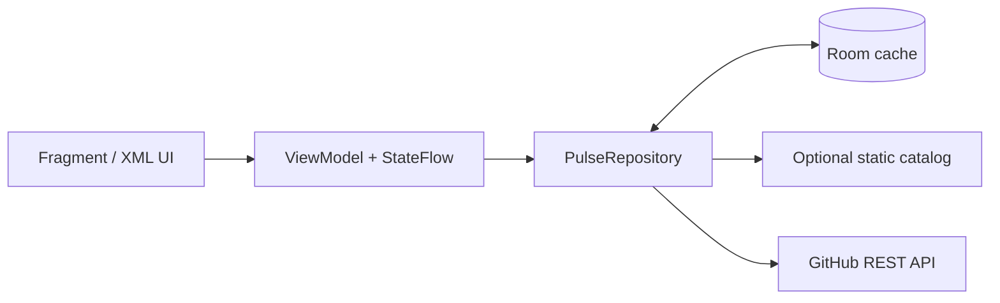

# DevPulse Studio

[](https://github.com/wcccy20613/DevPulseStudio/actions/workflows/android-checks.yml)

开源脉搏（DevPulse Studio）是一款面向中文开发者的 AI 开源项目发现与智能解读 Android 应用。它帮助用户完成发现、理解、收藏与学习，而不是复刻 GitHub 浏览器。

## 关键能力

- **状态与并发控制：** Kotlin、MVVM、ViewModel、StateFlow；[最新请求优先协调器](app/src/main/java/com/chunyan/devpulsestudio/ui/LatestRequestCoordinator.kt)统一处理检索、筛选和分页，避免迟到响应覆盖新列表。
- **双数据源与弱网降级：** [Repository](app/src/main/java/com/chunyan/devpulsestudio/data/PulseRepository.kt) 组合可选静态目录、GitHub REST API 与 [Room 快照缓存](app/src/main/java/com/chunyan/devpulsestudio/data/local/PulseDatabase.kt)；网络不可用时优先展示可识别的历史缓存而非伪造推荐结果。
- **模型访问边界：** Android 客户端不保存模型密钥；可选 Node.js 网关负责 README 中文解读的请求校验、缓存和基础限流。

## 发现页核心数据流



## 验证

`main` 分支 GitHub Actions 已通过 Debug APK 构建、20 项 JVM 单元测试、Lint，以及 API 30 模拟器上的 Room DAO、v1→v6 完整迁移和应用启动烟测；可查看[完整验证记录](https://github.com/wcccy20613/DevPulseStudio/actions/runs/32220475741)。

## Build

Open the project with Android Studio, configure the Android SDK in `local.properties`, then run:

```bash
./gradlew :app:assembleDebug
```

### Quality checks

Run the local debug build and unit-test suite with:

```bash
./gradlew :app:assembleDebug :app:testDebugUnitTest
```

GitHub Actions runs the same checks for pull requests and changes to `main`.
The discovery screen uses a latest-request-wins coordinator: changing a query,
filter, or ranking cancels the previous load and prevents a late response from
overwriting newer results.

## AI 服务边界

客户端从公开仓库读取 README；可选的服务端网关使用 DeepSeek 生成结构化中文解读。任何模型 API Key 只能配置在网关环境变量中，绝不能写入 Android 工程或 APK。

服务端接口与安全要求见 [AI_GATEWAY_CONTRACT.md](AI_GATEWAY_CONTRACT.md)。

### 部署中文解读网关

网关位于 [gateway](gateway/README.md)，可部署到任意支持 Docker 或 Node.js 20 的平台。部署环境变量：

```bash
DEEPSEEK_API_KEY=你的密钥
DEEPSEEK_MODEL=deepseek-v4-flash
PORT=8787
```

网关部署完成后，在构建 App 时配置：

```bash
./gradlew :app:assembleDebug -PAI_GATEWAY_URL=https://你的网关域名/
```

如不想维护常驻后端，可使用 GitHub Actions 生成并分发每日静态目录，说明见 [STATIC_CATALOG_PIPELINE.md](STATIC_CATALOG_PIPELINE.md)。

## Maintainer

Wang Chunyan (王纯炎) - 2477574245@qq.com

## License

Copyright (c) 2026 Wang Chunyan. Released under the MIT License.
